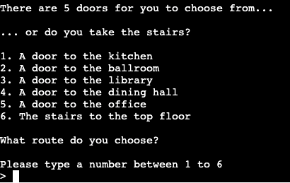
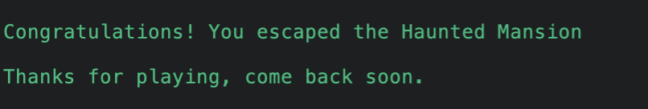

# The Haunted Mansion - Text Based Adventure Game.

## How to Play / Game Objective

The Haunted Mansion is an easy to play python terminal game which can be interacted with by the end user with the use of text. The project runs in the Code Institute terminal Heroku.

The objective of the game is to navigate through the Haunted Mansion and escape without dying. 

The game will firstly load in and set the scene, welcoming them to The Haunted Mansion.

The game objectives will shortly follow to give the end user an understanding of what they need to do.

The game will ask the user if they want to attempt to escape or accepct their fate. If they choose yes, the game will continue to their first set of choices. If they choose not to escape, the game will result in the player dying. However, the option to play again will be shown. 

The user will be able to choose out of 5 rooms and the stairs to explore the mansion. Each room will have some form of interaction that user will need to input via text. These options can result in a variety of outcomes and will change the direction of the game based on what is chosen.

The live link can be found here - [The Haunted Mansion - Text Based Adventure Game](https://the-haunted-mansion-d168abdc0e4f.herokuapp.com/)

## User Experience

As a first time user I want to know the purpose of the game.

As a first time user I want to know how to play the game. 

As a first time user I want to be told if I have entered text incorrectly.

As a first time user I want to be able to have the option of playing again if I do not win or even if I do win.

As a first time user I want to know when I have lost and when I have won the game. 

As a returning user, all of the above experiences should also apply.

## Features

### User Input

Interaction with the game is the main part of The Haunted Mansion. All rooms will require some form of intereaction where a user is required to make a decision which can result in either collecting items, moving through rooms, dicsovering dead ends, encountering enemies that may result in death.

### Visual Features

I created visual pictures in the terminal for items that can be collected throughout the mansion.

     

 

### Backpack

The backpack is an inventory of the items the user can collect throughout the mansion. Each time an item is collected the backpack contents will be shown to the user.

### Rooms

Rooms can be explored by the user selecting from the list when they are in the hallway. A feature is in place that if the user has visited a room previously and collected the item they will be told so they do not enter the room again. This will automatically send them back to the hallway to choose a different option.

### Win and Loss 

The terminal will always display when a user has lost the game as well as when they win the game. After this the user will be given the option to play again.

### Replay

The user will always be prompted with the play again function when the following occurs:

- Chooses not to play the game initially.
- Fails a room and dies at any point throughout.
- After winning the game.

## Technologies

* Python was used as the programming language to make the game.
* [LucidChart](https://www.lucidchart.com/pages/) was used to create the flow chart showing the game's logic.
* [GitHub](https://github.com/) has been used to store the code, images, readMe file and other content. 
* [Heroku](https://dashboard.heroku.com/apps) was used to deploy the game to the browser to allow playing in a terminal.
* Python module [time](https://docs.python.org/3/library/time.html) has been used to allow for a delay between lines of text displaying.
* I used the chrome extension [Screen Recorder](https://chromewebstore.google.com/detail/screen-recorder/hniebljpgcogalllopnjokppmgbhaden) to record the deployed terminal before coverting into a gif.
* [Ezgif](https://ezgif.com/video-to-gif) was used to change video recordings into gifs for ReadME document.

## Testing

### Validator Testing

The project was tested via [Code Institutes PEP8 Linter](https://pep8ci.herokuapp.com/) and returned no errors.

### Project Testing

All scenarios were tested locally on CodeAnywhere terminal and then again after deployment on the Heroku App.

The below flow chart was used as reference to ensure each function performed the correct actions based on the users input and status.

### Functions

#### intro()

| Test                                                        | Action                                                                                                                     | Expected                                                     | Result |
| ----------------------------------------------------------- | -------------------------------------------------------------------------------------------------------------------------- | ------------------------------------------------------------ | ------ |
| Does the intro function call when the terminal loads        | Load terminal in CodeAnywhere and Heroku. Check if intro function runs properly.                                           | Intro function calls correctly when the terminal loads       | Pass   |
| Does the intro function display all text correctly          | Load terminal in CodeAnywhere and Heroku. Check if all text shows correctly in terminal                                    | Intro function displays all text correctly in terminal       | Pass   |
| At the end of the function does start_game() call correctly | In the terminal of CodeAnywhere and Heroku when the intro function ends make sure the start game function loads correctly. | At the end of the function start_game() is called correctly. | Pass   |

#### start_game()

| Test                                                                                                                         | Action                                                                                                                           | Expected                                                                                                                   | Result |
| ---------------------------------------------------------------------------------------------------------------------------- | -------------------------------------------------------------------------------------------------------------------------------- | -------------------------------------------------------------------------------------------------------------------------- | ------ |
| Does start_game load in after intro()                                                                                        | Load terminal in CodeAnywhere and Heroku. Intro loads and check if start game function loads in after intro finishes             | start_game correctly shows after intro finishes.                                                                           | Pass   |
| Does the function correctly ask the user whether they want to play the game or not.                                          | Check if input section appears and allows user to type                                                                           | User can type input section on whether they want to play the game or not                                                   | Pass   |
| If user selects 'Yes' does the hallway() function correctly load                                                             | Type yes into the console and see if the hallway() function correctly loads                                                      | After typing yes, hallway() function loads in correctly                                                                    | Pass   |
| If the user selects 'No' does the text display correctly and then load the play_again function                               | Type No into the terminal. Check that the correct text displays. Check for play_again function to be callled.                    | Typing no ends the game for the user but then loads the play again function asking the user if they do want to play again. | Pass   |
| If the user enters text that is not 'yes' or 'no' does the terminal display incorrect input and ask the user to input again. | Type any other text into the input section of the terminal. Check that the error text shows and asks the user to type yes or no. | Incorrect input message shows up if anything else is entered besides, 'yes' or 'no'. The question is then asked again.     | Pass   |

#### play_again()

| Test                                                                                                                         | Action                                                                                                                                                                                                                                  | Expected                                                                                                                                                                | Result |
| ---------------------------------------------------------------------------------------------------------------------------- | --------------------------------------------------------------------------------------------------------------------------------------------------------------------------------------------------------------------------------------- | ----------------------------------------------------------------------------------------------------------------------------------------------------------------------- | ------ |
| Does play_again load in after every time the user loses the game or chooses not to play.                                     | Load terminal in CodeAnywhere and Heroku. Using the flowchart for reference go through each scenerio where play_again() is called and check the play again function shows in terminal asking the user to input yes or no to play again. | User sees option to type yes or no to play again each time the function is called. After losing, winning the game or choosing not to play the game at the start.        | Pass   |
| Does the function correctly ask the user whether they want to play the game againor not.                                     | Check if input section appears and allows user to type. Clearly showing whether to type yes or no.                                                                                                                                      | User can type input section on whether they want to play the game again or not                                                                                          | Pass   |
| If user selects 'Yes' does the console clear correctly                                                                       | Type yes into the console and see if the intro() function correctly loads                                                                                                                                                               | After typing yes, intro() function loads in correctly                                                                                                                   | Pass   |
| If user selects 'Yes' does the backpack list clear correctly                                                                 | Type yes to play again, using the workflow for reference go into a room and collect and item to ensure backpack is empty when the item is appended to the list.                                                                         | No items from the previous playthrough have carried over and the backpack is empty. Appending newly collected items from the current playthrough                        | Pass   |
| If user selects 'Yes' do all global items reset to False                                                                     | Type yes to play again, using the workflow, go into a room with a global item. Check if you are able to enter the room as normal even if you had the item in the previous playthrough.                                                  | All rooms can be accessed as if it was the first time even after a playthrough. Functions work correctly based on global item status.                                   | Pass   |
| If user selects 'Yes' does the intro() function call correctly.                                                              | Type Yes to play again and ensure the intro function is called and runs correctly.                                                                                                                                                      | After clicking yes, console clears and game restarts running the intro() function.                                                                                      | Pass   |
| If the user selects 'No' does the text display correctly and then load the end_game function                                 | Type No into the terminal. Check that the correct text displays. Check end_game function loads after and then user will still be given the option to play again and therefore calls play_again function from the end_game function      | Typing no ends the game for the user but then loads the end_game function clearing the display and then calls play_again asking the user if they do want to play again. | Pass   |
| If the user enters text that is not 'yes' or 'no' does the terminal display incorrect input and ask the user to input again. | Type any other text into the input section of the terminal. Check that the error text shows and asks the user to type yes or no.                                                                                                        | Incorrect input message shows up if anything else is entered besides, 'yes' or 'no'. The question is then asked again.                                                  | Pass   |

#### end_game()

| Test                                                                 | Action                                                                                                       | Expected                                                                                                                                                                                    | Result |
| -------------------------------------------------------------------- | ------------------------------------------------------------------------------------------------------------ | ------------------------------------------------------------------------------------------------------------------------------------------------------------------------------------------- | ------ |
| Does end_game call when a user clicks no in the play again function. | Choose no when the play_again function is dispayed                                                           | end_game should run and clear the console,finally displaying the option to play again.                                                                                                      | Pass   |
| Does end_game show after the user wins the game                      | Win the game, wait for game_win function to show and then wait for the consle to clear                       | After winning the game and seeing the game_win text. The end_game function is called, clearing the display and asking user if they want to play again from calling the play_again function. | Pass   |
| Does the console clear once the end_game function is called.         | Using the workflow get to each point where end_game function is called and wait to see if the console clears | Console clears all data each time end_game is called.                                                                                                                                       | Pass   |

#### hallway()

| Test                                                                                                                                            | Action                                                                                                      | Expected                                                                                                                                     | Result |
| ----------------------------------------------------------------------------------------------------------------------------------------------- | ----------------------------------------------------------------------------------------------------------- | -------------------------------------------------------------------------------------------------------------------------------------------- | ------ |
| When called does the hallway display all options (rooms) for the user to choose from                                                            | Using workflow go through each scenario where the hallway is called to ensure the results are the same      | Hallway is called correctly and shows correct text and the rooms to choose from along with the input section                                 | Pass   |
| Does the input section show allowing the user to choose a room to enter                                                                         | Get to the hallway function in each scenario and ensure the ability is there to enter data to choose a room | Each time hallway is called the same results show allowing the user to input their choice of room to go to.                                  | Pass   |
| If 1 is entered does the kitchen function get called                                                                                            | Type 1 into the console to check that the kitchen function loads in the terminal                            | Kitchen functions correctly loads after inputting 1 from the hallway function                                                                | Pass   |
| If 2 is entered does the ballroom function get called                                                                                           | Type 2 into the console to check that the ballroom function loads in the terminal                           | Ballroom function correctly loads after inputting 2 from the hallway function                                                                | Pass   |
| If 3 is entered does the library function get called                                                                                            | Type 3 into the console to check that the library function loads in the terminal                            | Library function correctly loads after inputting 3 from the hallway function                                                                 | Pass   |
| If 4 is entered does the dining hall function get called                                                                                        | Type 4 into the console to check that the dining hall function loads in the terminal                        | Dining Hall function correctly loads after inputting 4 from the hallway function                                                             | Pass   |
| If 5 is entered does the office function get called                                                                                             | Type 5 into the console to check that the office function loads in the terminal                             | Office function correctly loads after inputting 5 from the hallway function                                                                  | Pass   |
| If 6 is entered does the stairs function get called                                                                                             | Type 6 into the console to check that the stairs function loads in the terminal                             | Stairs function correctly loads after inputting 6 from the hallway function                                                                  | Pass   |
| If anything else is entered other than 1 - 6 is the user propmted of incorrect input and asks the options to enter a number between 1 - 6 again | Type a selection of other characters to see if incorrect input shows and input asked again                  | Entering any other character(s) beside 1 - 6 shows incorrect input and question is asked to the user again to enter a number between 1 and 6 | Pass   |

#### kitchen()

#### kitchen_continue()

#### ballroom()

#### ballroom_continue()

#### library()

#### library_continue()

#### dining_hall()

#### office()

#### stairs()

#### clear_display()

| Test                                                                                  | Action                                                                                                                                                          | Expected                                                                          | Result |
| ------------------------------------------------------------------------------------- | --------------------------------------------------------------------------------------------------------------------------------------------------------------- | --------------------------------------------------------------------------------- | ------ |
| Does clear display correctly clear the display when called. Tested on Mac and Windows | Run through game to get to the stages where clear_display is called and check that terminal clears correctly and then continues with the next function or text. | Console correctly clears when called on Macbook Pro and Lenovo Thinkpad (Windows) | Pass   |

### Bugs / Other

Luckily most bugs occured due to typos in functions and time.sleep typos.

I had an issue with declaring global variables as they were called before. This was due to referencing them more than once in a function based on the way I wanted to set it up. I decided to seperate functions with _continue when declaring global variables as True or False.

## Deployment

### GitHub

This project was developed by using the specialized [Code Institute template](https://github.com/Code-Institute-Org/python-essentials-template) which simulates a terminal in the web browser to play the project. 

1. Click Use this template
2. Name the repository
3. Copy the repository link into CodeAnywhere to use the template within the IDE.

### Version Control

The site was created using the CodeAnywhere code editor and pushed to github.

The following git commands were used throughout development to push code to the remote repo:

1. git add . - This command was used to add the file(s) to the staging area before they are committed.

2. git commit -m “commit message” - This command was used to commit changes to the local repository queue ready for the final step.

3. git push - This command was used to push all committed code to the repository on github.

### **Final Deployment with Heroku**

The below steps were followed to deploy this project to the Heroku App:

1. Go to [Heroku](https://dashboard.heroku.com/apps) and click "New" to create a new app.
2. After choosing the app name and setting the region, press "Create app".
3. In "Settings", navigate to Buildpacks and add buildpacks for Python and NodeJS (in order).
5. Leave "Settings" and go to "Deploy". Scroll down and set Deployment Method to GitHub.
Once GitHub is chosen, find your repository by typing in the name and connect it to Heroku.
6. Scroll down to Manual Deploy, make sure the "main" branch is selected and click "Deploy Branch". 
7. The deployed app can be found [here]().

## Credits

I used [Geeks for Geeks](https://www.geeksforgeeks.org/clear-screen-python/) for the code in the clear_display function so that the console would be cleared at particular times.

I used [Lucid Chart](https://www.lucidchart.com/pages/landing?utm_source=google&utm_medium=cpc&utm_campaign=_chart_en_tier1_mixed_search_brand_exact_&km_CPC_CampaignId=1490375427&km_CPC_AdGroupID=55688909257&km_CPC_Keyword=lucid%20chart&km_CPC_MatchType=e&km_CPC_ExtensionID=&km_CPC_Network=g&km_CPC_AdPosition=&km_CPC_Creative=442433236004&km_CPC_TargetID=kwd-55720648523&km_CPC_Country=1006984&km_CPC_Device=c&km_CPC_placement=&km_CPC_target=&gad_source=1&gclid=Cj0KCQiAzoeuBhDqARIsAMdH14H3VQDVvCMFaJMPK_U96cnlAH2tstOaQgt56FI7YiNTu4H57idfyRQaAr1gEALw_wcB) to create the flow diagram of the project. This helped with putting the project together and testing the project during and upon completion.

I used [Code Institutes PEP8 Linter](https://pep8ci.herokuapp.com/) to run my python code through to check for any errors.

[Table to Markdown](https://tabletomarkdown.com/) to use tables in ReadME document for testing.

Thanks to Daisty Mc Girr for assisting me through this project and answering questions I had around coding and testing. Also giving me the idea of doing an adventure based text game.

The Code Institute lessons and Love Sandwiches walkthrough for knowledge on coding Python.

